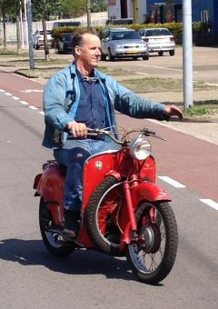

<aside>
  <figure>
    
  </figure>
</aside>

<aside>
  <figure>
    <figcaption>
      <a href="https://www.metaalunie.nl/" class="metaalunie img-thumbnail" target="_blank" title="Naar de website van de Koninklijke Metaalunie">
        
        Lid van de Koninklijke Metaalunie.
      </a>
    </figcaption>
  </figure>
</aside>

Rezelman RVS & Aluminium legt zich al vele jaren toe op het leveren van maatwerk in zowel de
[scheeps­bouw](),
[meubilair](), als
[motor­fietsen]() en een verscheidenheid aan
[andere projecten]().

Sinds 1991 streven wij ernaar te voldoen aan al uw wensen op het gebied van roestvrijstaal, aluminium, staal, brons, en andere non-ferro metalen en combinaties hiervan. Aan de hand van uw eigen of ons creatief ontwerp, zoeken wij naar de optimale realisatie van uw ideeën.

U kunt voor materialen en reparaties bij ons terecht. Wanneer nodig voeren wij reparaties en installaties op locatie uit.

U bent van harte welkom in onze werkplaats aan de {{ site.contact_address }} in {{ site.contact_city }}.

Wij voeren onder andere de volgende [werkzaamheden]() uit:

- TIG Lassen
- MIG/MAG Lassen
- Draaien
- Frezen
- Zagen
- Buigen
- Walsen
- Zetten
- Polijsten

